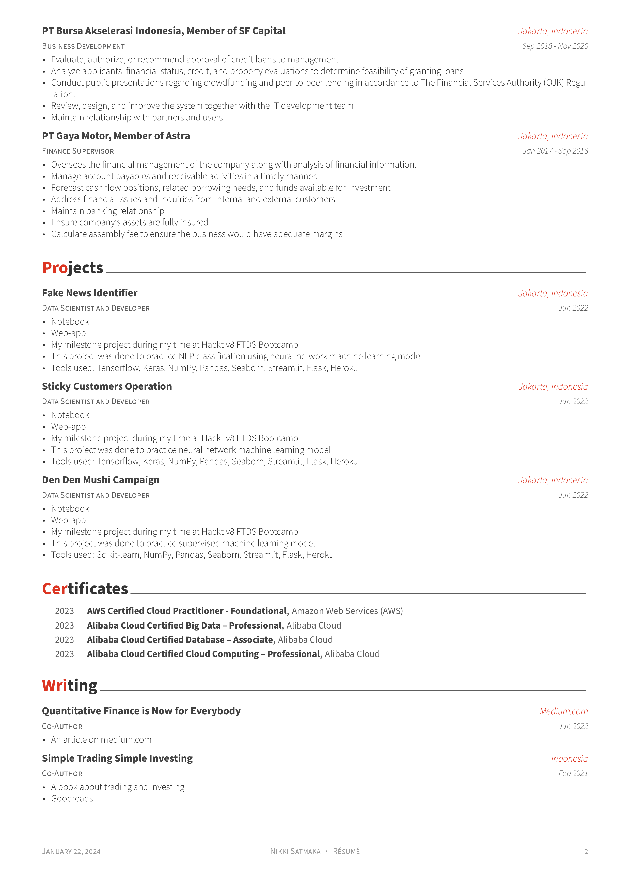

# My Résumé

This is my resume created with [**Awesome CV**](https://github.com/posquit0/Awesome-CV)

# Preview

## Résumé

You can see [PDF](nikki/resume.pdf)

| Page. 1 | Page. 2 |
|:---:|:---:|
| [](nikki/resume.pdf) | [](nikki/resume.pdf) |

<!-- ## Cover Letter

You can see [PDF](nikki/coverletter.pdf)

| Without Sections | With Sections |
|:---:|:---:|
| [](nikki/coverletter.pdf)  | [](nikki/coverletter.pdf) |
 -->

# Quick Start

* [**Edit Résumé on OverLeaf.com**](https://www.overleaf.com/latex/templates/awesome-cv/tvmzpvdjfqxp)
* [**Edit Cover Letter on OverLeaf.com**](https://www.overleaf.com/latex/templates/awesome-cv-cover-letter/pfzzjspkthbk)

**_Note:_ Above services do not guarantee up-to-date source code of Awesome CV**


<!-- # How to Use

## Requirements

A full TeX distribution is assumed.  [Various distributions for different operating systems (Windows, Mac, \*nix) are available](http://tex.stackexchange.com/q/55437) but TeX Live is recommended.
You can [install TeX from upstream](https://tex.stackexchange.com/q/1092) (recommended; most up-to-date) or use `sudo apt-get install texlive-full` if you really want that.  (It's generally a few years behind.)

If you don't want to install the dependencies on your system, this can also be obtained via [Docker](https://docker.com).

#### Usage

At a command prompt, run

```bash
$ xelatex {your-cv}.tex
```

Or using docker:

```bash
$ docker run --rm --user $(id -u):$(id -g) -i -w "/doc" -v "$PWD":/doc thomasweise/texlive make
```

In either case, this should result in the creation of ``{your-cv}.pdf`` -->


# Credit

[**Awesome CV**](https://github.com/posquit0/Awesome-CV) is LaTeX template for a CV(Curriculum Vitae), Résumé or Cover Letter inspired by [Fancy CV](https://www.sharelatex.com/templates/cv-or-resume/fancy-cv). It is easy to customize your own template, especially since it is really written by a clean, semantic markup.

[**LaTeX**](https://www.latex-project.org) is a fantastic typesetting program that a lot of people use these days, especially the math and computer science people in academia.

[**LaTeX FontAwesome**](https://github.com/furl/latex-fontawesome) is bindings for FontAwesome icons to be used in XeLaTeX.

[**Roboto**](https://github.com/google/roboto) is the default font on Android and ChromeOS, and the recommended font for Google’s visual language, Material Design.

[**Source Sans Pro**](https://github.com/adobe-fonts/source-sans-pro) is a set of OpenType fonts that have been designed to work well in user interface (UI) environments.


# Contact

You are free to take my `.tex` file and modify it to create your own resume. Please don't use my resume for anything else without my permission, though!

If you have any questions, feel free to contact me at [LinkedIn](https://www.linkedin.com/in/nikkisatmaka/) and ask away.

<!-- If you have any questions, feel free to join me at [`#posquit0` on Freenode](irc://irc.freenode.net/posquit0) and ask away. Click [here](https://kiwiirc.com/client/irc.freenode.net/posquit0) to connect. -->

Good luck!


# Maintainers
- [posquit0](https://github.com/posquit0)
- [OJFord](https://github.com/OJFord)


# See Also

* [Awesome Identity](https://github.com/posquit0/hugo-awesome-identity) - A single-page Hugo theme to introduce yourself.
